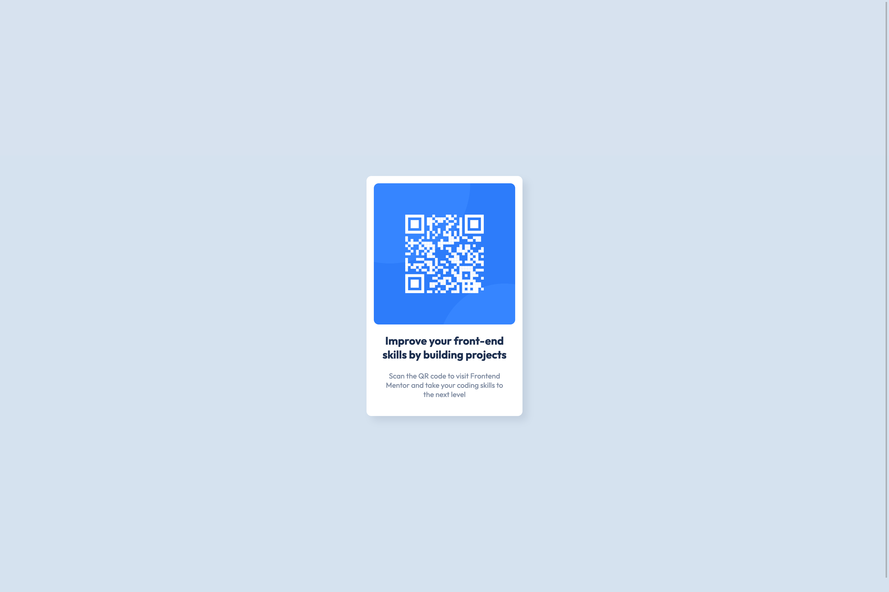

# Frontend Mentor - QR code component solution

This is a solution to the [QR code component challenge on Frontend Mentor](https://www.frontendmentor.io/challenges/qr-code-component-iux_sIO_H). Frontend Mentor challenges help you improve your coding skills by building realistic projects.

## Table of contents

- [Overview](#overview)
    - [Screenshot](#screenshot)
    - [Links](#links)
- [My process](#my-process)
    - [Built with](#built-with)
    - [What I learned](#what-i-learned)
    - [Continued development](#continued-development)
    - [Useful resources](#useful-resources)
- [Author](#author)

## Overview

### Screenshot




### Links

- Solution URL: [GitHub repository](https://github.com/justinconnell/fem-qr-code)
- Live Site URL: [Live site](https://justinconnell.github.io/fem-qr-code/)

## My process

### Built with

- Semantic HTML5 markup
- CSS custom properties
- Flexbox
- BEM

### What I learned

My main focus in this challenge is to learn and practice structuring HTML and CSS in a logical and maintainable fashion. I used what I have learned this week through video tutorials on Frontend Masters and Udemy.

I decided to structure the HTML using semantic markup as follows:

```html
<main>
  <section class="card card--shadow">
    
    <h1 class="card__heading">
      Improve your front-end skills by building projects
    </h1>
    <p class="card__text">
      Scan the QR code to visit Frontend Mentor and take your coding skills to
      the next level
    </p>
  </section>
</main>
```

I used custom CSS properties to define variables in a single place for values that may change in future.

```css
:root {
  --font-family: "Outfit", sans-serif;
  --font-weight-normal: 400;
  --font-weight-bold: 700;

  --white: hsl(0, 0%, 100%);
  --light-gray: hsl(212, 45%, 89%);
  --grayish-blue: hsl(220, 15%, 55%);
  --dark-blue: hsl(218, 44%, 22%);
}
```

I wanted to use 'rem' units for sizing so I made the calculation easier by implimenting the following CSS:

```css
/* Set 1rem = 10px */
html {
  font-size: 62.5%;
}
```

### Continued development

I plan to continue focussing on CSS and learn the Sass workflow. I also plan to use vanilla JS until I get a solid grip on the base technologies, thereafter I plan to learn React and Vue.

### Useful resources

- [MindBEMding – getting your head ’round BEM syntax](https://csswizardry.com/2013/01/mindbemding-getting-your-head-round-bem-syntax/) - This helped clarify the concept of BEM for me.
- [2 ways to Center Elements with Flexbox](https://www.samanthaming.com/tidbits/84-2-ways-to-center-elements-with-flexbox/) - Really concise article on using flexbox to position elements in a container.

## Author

- GitHub - [Justin](https://github.com/justinconnell)
- Frontend Mentor - [@justinconnell](https://www.frontendmentor.io/profile/justinconnell)
- Twitter - [@justin2code](https://twitter.com/justin2code)
